# 📊 Modelado de Datos y Diagrama de Clases

> **Proyecto**: App Didáctica CRUD de Alumnos  
> **Fase**: 3-B (Modelado Estático)  
> **Fecha**: 2025-12-22  
> **Estado**: Pendiente de Aprobación

---

## 📑 Índice

1. [Modelo de Datos Lógico (DER)](#1-modelo-de-datos-lógico-der)
2. [Modelo de Datos Físico (SQL)](#2-modelo-de-datos-físico-sql)
3. [Diagrama de Clases (Backend POO)](#3-diagrama-de-clases-backend-poo)
4. [Diccionario de Datos](#4-diccionario-de-datos)
5. [Mapeo Patrones ↔ Clases](#5-mapeo-patrones--clases)

---

## 1. Modelo de Datos Lógico (DER)

### 1.1 Diagrama Entidad-Relación

Para este MVP, tenemos una única entidad principal: **Alumno**.

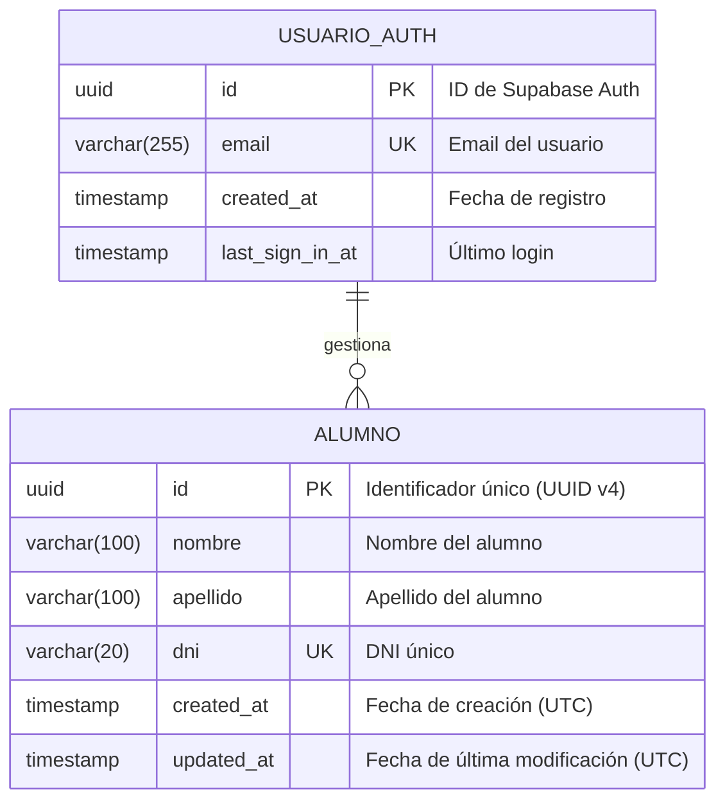

### 1.2 Descripción del Modelo

| Entidad | Descripción | Responsabilidad |
|---------|-------------|-----------------|
| **ALUMNO** | Entidad principal del sistema | Almacena datos de estudiantes |
| **USUARIO_AUTH** | Manejada por Supabase Auth | Autenticación y sesión (no la creamos nosotros) |

### 1.3 Relaciones

| Relación | Tipo | Descripción |
|----------|------|-------------|
| USUARIO_AUTH → ALUMNO | 1:N (opcional) | Un usuario puede gestionar múltiples alumnos. En este MVP, no hay RLS por usuario (todos ven todo). |

> **📝 Nota sobre USUARIO_AUTH**: Esta tabla es gestionada automáticamente por Supabase Auth. No la creamos ni modificamos directamente; solo consumimos el JWT que genera.

### 1.4 Modelo Extendido (Futuro)

Si en el futuro se requiere trazabilidad de quién creó cada alumno:

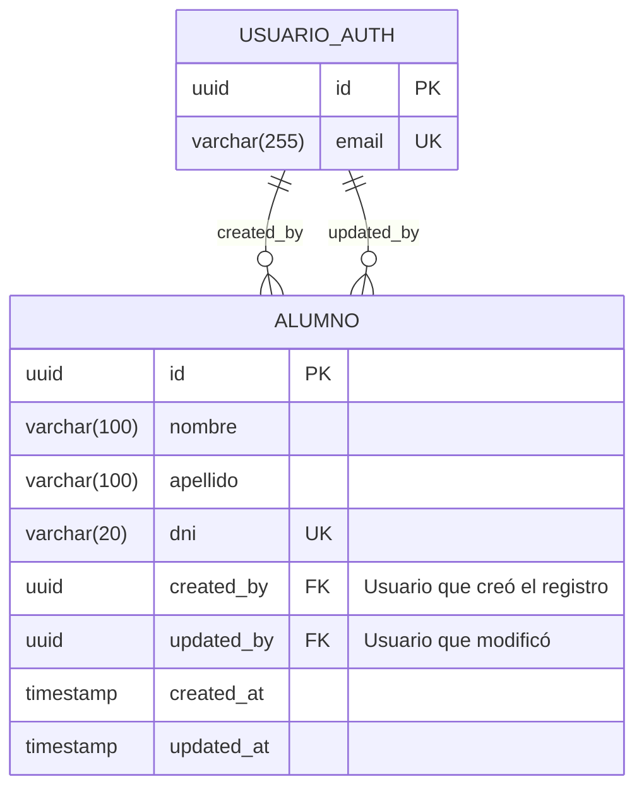

> ⚠️ Este modelo extendido está **FUERA DEL ALCANCE del MVP**. Se documenta para referencia futura.

---

## 2. Modelo de Datos Físico (SQL)

### 2.1 Script de Creación (Supabase)

```sql
-- ═══════════════════════════════════════════════════════════════
-- MODELO FÍSICO: TABLA ALUMNOS
-- Ejecutar en Supabase SQL Editor
-- ═══════════════════════════════════════════════════════════════

-- Extensión para generar UUIDs (ya viene habilitada en Supabase)
-- CREATE EXTENSION IF NOT EXISTS "uuid-ossp";

-- ───────────────────────────────────────────────────────────────
-- TABLA PRINCIPAL: alumnos
-- ───────────────────────────────────────────────────────────────
CREATE TABLE IF NOT EXISTS alumnos (
    -- Clave primaria: UUID generado automáticamente
    -- POR QUÉ UUID: Seguro, no expone cantidad de registros, 
    -- funciona en sistemas distribuidos
    id UUID PRIMARY KEY DEFAULT gen_random_uuid(),
    
    -- Datos del alumno
    -- POR QUÉ VARCHAR(100): Balance entre flexibilidad y límite razonable
    nombre VARCHAR(100) NOT NULL,
    apellido VARCHAR(100) NOT NULL,
    
    -- DNI único
    -- POR QUÉ VARCHAR(20): Permite diferentes formatos internacionales
    -- POR QUÉ UNIQUE: Requisito de negocio RF-005
    dni VARCHAR(20) UNIQUE NOT NULL,
    
    -- Timestamps de auditoría
    -- POR QUÉ TIMESTAMP WITH TIME ZONE: Seguridad en zonas horarias
    -- POR QUÉ DEFAULT NOW(): Automático, menos errores humanos
    created_at TIMESTAMP WITH TIME ZONE DEFAULT NOW() NOT NULL,
    updated_at TIMESTAMP WITH TIME ZONE DEFAULT NOW() NOT NULL
);

-- ───────────────────────────────────────────────────────────────
-- ÍNDICES
-- ───────────────────────────────────────────────────────────────

-- Índice para búsqueda por DNI (ya implícito por UNIQUE, pero explícito)
CREATE INDEX IF NOT EXISTS idx_alumnos_dni ON alumnos(dni);

-- Índice para ordenar por apellido (caso de uso más común)
CREATE INDEX IF NOT EXISTS idx_alumnos_apellido ON alumnos(apellido);

-- Índice compuesto para búsqueda por nombre completo
CREATE INDEX IF NOT EXISTS idx_alumnos_nombre_apellido ON alumnos(apellido, nombre);

-- ───────────────────────────────────────────────────────────────
-- TRIGGER: Actualizar updated_at automáticamente
-- ───────────────────────────────────────────────────────────────

-- Función que actualiza el timestamp
CREATE OR REPLACE FUNCTION update_updated_at_column()
RETURNS TRIGGER AS $$
BEGIN
    -- POR QUÉ NOW() sin timezone.utc: Supabase maneja UTC internamente
    NEW.updated_at = NOW();
    RETURN NEW;
END;
$$ LANGUAGE plpgsql;

-- Trigger que ejecuta la función antes de cada UPDATE
DROP TRIGGER IF EXISTS trigger_alumnos_updated_at ON alumnos;
CREATE TRIGGER trigger_alumnos_updated_at
    BEFORE UPDATE ON alumnos
    FOR EACH ROW
    EXECUTE FUNCTION update_updated_at_column();

-- ───────────────────────────────────────────────────────────────
-- COMENTARIOS DE DOCUMENTACIÓN
-- ───────────────────────────────────────────────────────────────

COMMENT ON TABLE alumnos IS 'Tabla principal que almacena datos de estudiantes. Parte del MVP CRUD.';
COMMENT ON COLUMN alumnos.id IS 'Identificador único UUID v4, generado automáticamente.';
COMMENT ON COLUMN alumnos.nombre IS 'Nombre del alumno. Requerido. Máximo 100 caracteres.';
COMMENT ON COLUMN alumnos.apellido IS 'Apellido del alumno. Requerido. Máximo 100 caracteres.';
COMMENT ON COLUMN alumnos.dni IS 'Documento Nacional de Identidad. Único en todo el sistema.';
COMMENT ON COLUMN alumnos.created_at IS 'Timestamp de creación del registro (UTC).';
COMMENT ON COLUMN alumnos.updated_at IS 'Timestamp de última modificación (UTC). Actualizado automáticamente.';
```

### 2.2 Row Level Security (RLS) - Básico

```sql
-- ═══════════════════════════════════════════════════════════════
-- ROW LEVEL SECURITY (RLS)
-- Protege la tabla a nivel de fila
-- ═══════════════════════════════════════════════════════════════

-- Habilitar RLS en la tabla
ALTER TABLE alumnos ENABLE ROW LEVEL SECURITY;

-- Política: Solo usuarios autenticados pueden ver alumnos
-- POR QUÉ: Previene acceso anónimo a datos
CREATE POLICY "Usuarios autenticados pueden leer alumnos"
    ON alumnos
    FOR SELECT
    TO authenticated
    USING (true);

-- Política: Solo usuarios autenticados pueden insertar
CREATE POLICY "Usuarios autenticados pueden crear alumnos"
    ON alumnos
    FOR INSERT
    TO authenticated
    WITH CHECK (true);

-- Política: Solo usuarios autenticados pueden actualizar
CREATE POLICY "Usuarios autenticados pueden editar alumnos"
    ON alumnos
    FOR UPDATE
    TO authenticated
    USING (true)
    WITH CHECK (true);

-- Política: Solo usuarios autenticados pueden eliminar
CREATE POLICY "Usuarios autenticados pueden eliminar alumnos"
    ON alumnos
    FOR DELETE
    TO authenticated
    USING (true);

-- ───────────────────────────────────────────────────────────────
-- NOTA: En un sistema con múltiples usuarios, se agregaría:
-- USING (created_by = auth.uid())
-- Para que cada usuario solo vea sus propios registros.
-- Esto está FUERA DEL ALCANCE del MVP.
-- ───────────────────────────────────────────────────────────────
```

### 2.3 Datos de Prueba (Opcional)

```sql
-- ═══════════════════════════════════════════════════════════════
-- DATOS DE PRUEBA (Solo para desarrollo)
-- ═══════════════════════════════════════════════════════════════

-- Insertar algunos alumnos de ejemplo
INSERT INTO alumnos (nombre, apellido, dni) VALUES
    ('Juan', 'Pérez', '12345678'),
    ('María', 'González', '23456789'),
    ('Carlos', 'López', '34567890'),
    ('Ana', 'Martínez', '45678901'),
    ('Luis', 'García', '56789012');

-- Verificar inserción
SELECT * FROM alumnos ORDER BY apellido;
```

---

## 3. Diagrama de Clases (Backend POO)

### 3.1 Diagrama Completo del Sistema

Este diagrama refleja todos los patrones definidos en la Fase 3-A:

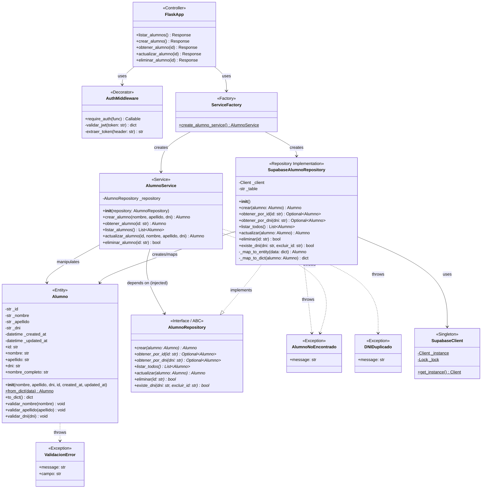

### 3.2 Diagrama por Capas (Simplificado)

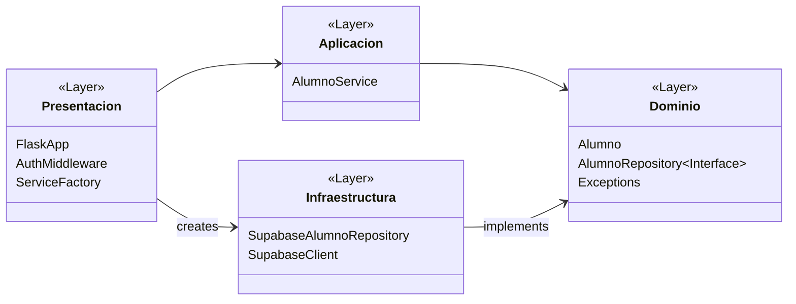

### 3.3 Diagrama de Secuencia: Crear Alumno

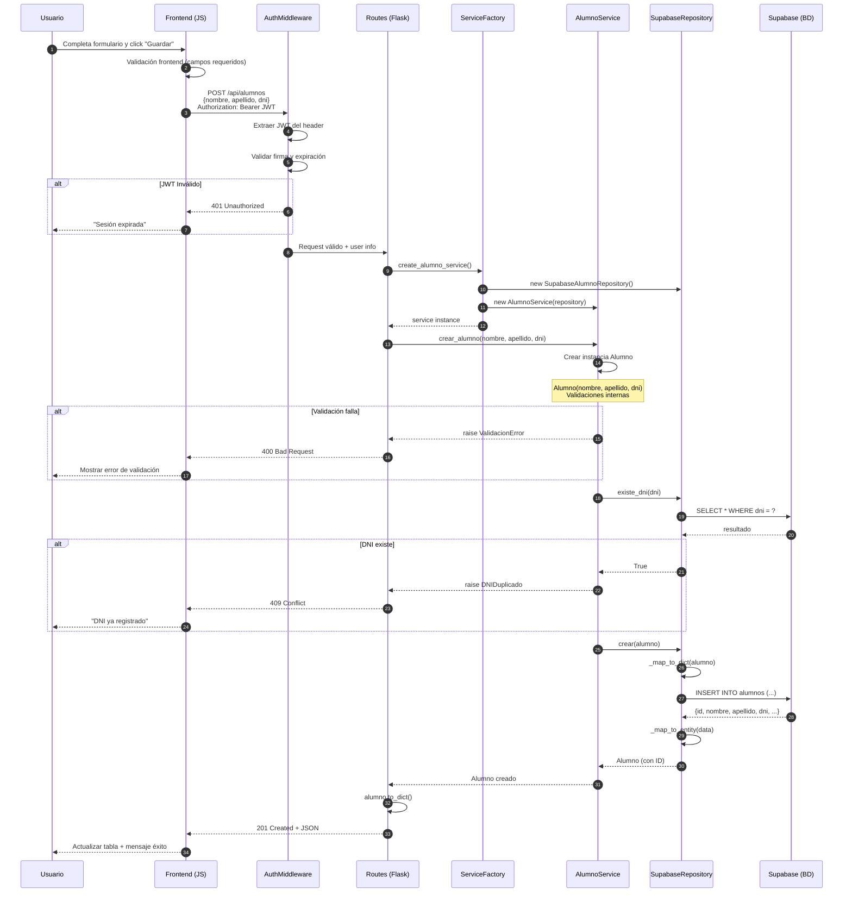

### 3.4 Detalle de Cada Clase

#### 3.4.1 Entidad: Alumno

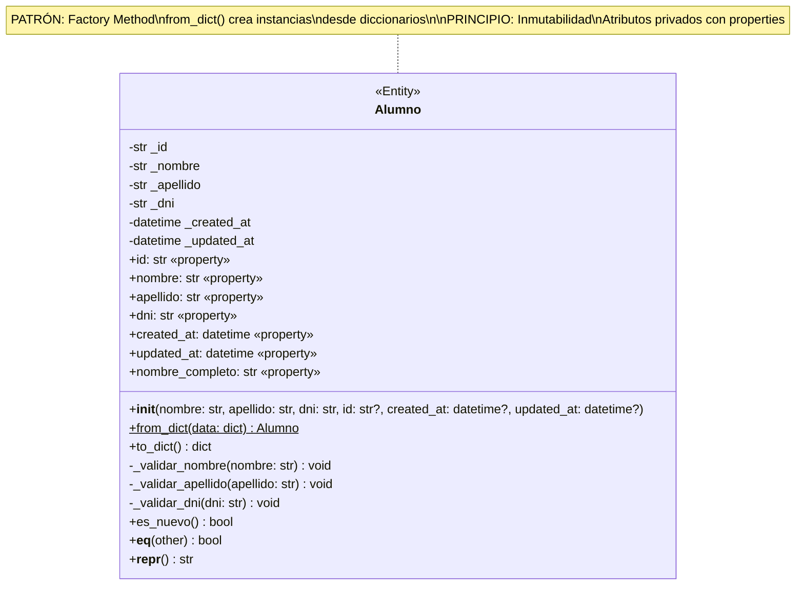

#### 3.4.2 Interface: AlumnoRepository

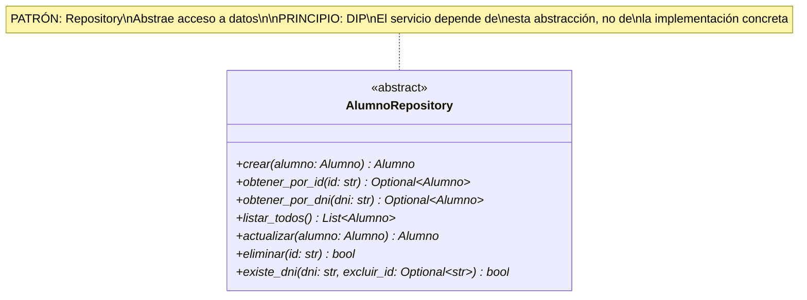

#### 3.4.3 Implementación: SupabaseAlumnoRepository

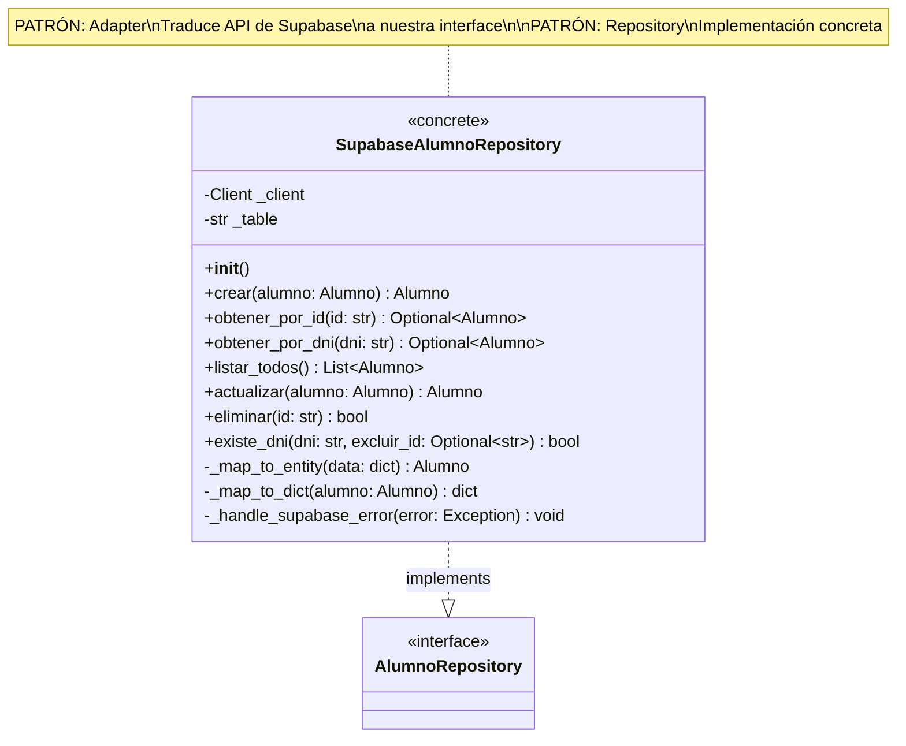

#### 3.4.4 Servicio: AlumnoService

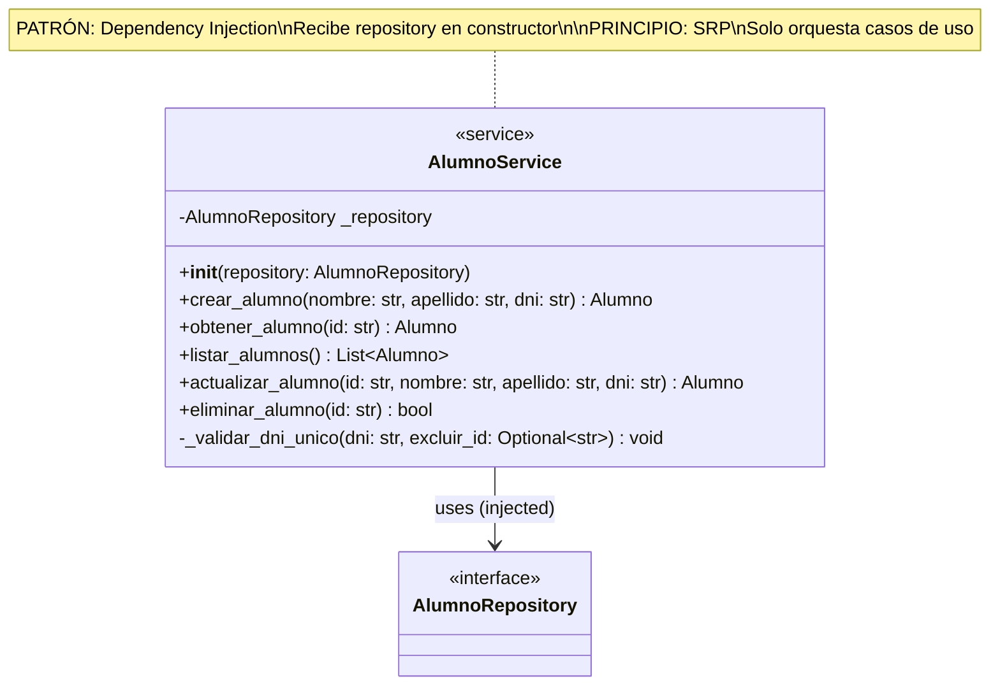

#### 3.4.5 Singleton: SupabaseClient

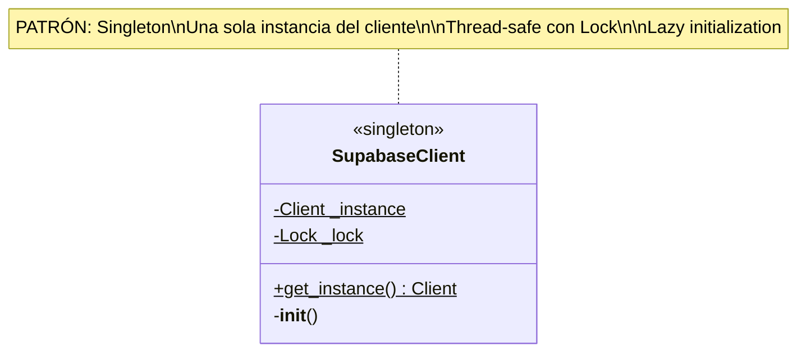

#### 3.4.6 Factory: ServiceFactory

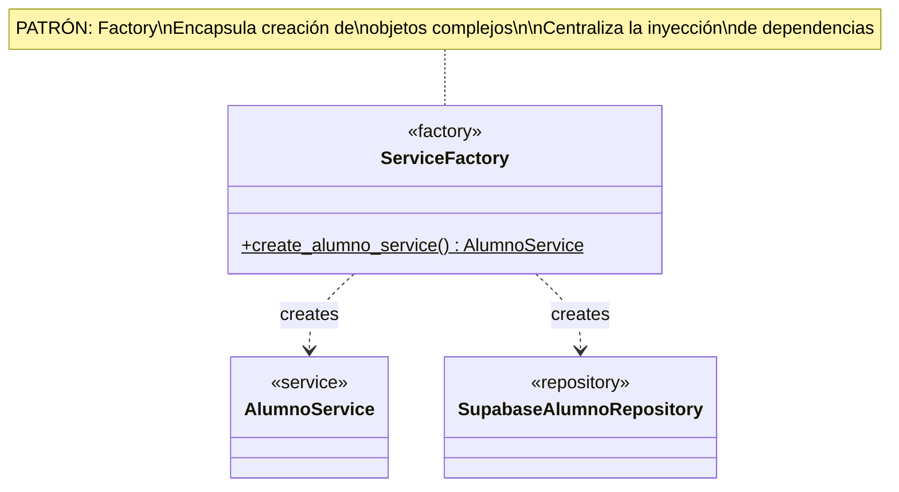

#### 3.4.7 Decorator: AuthMiddleware

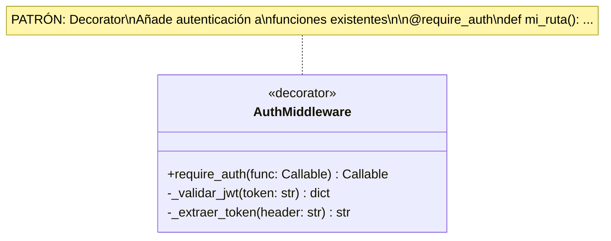

---

## 4. Diccionario de Datos

### 4.1 Tabla: alumnos

| Campo | Tipo SQL | Tipo Python | Nullable | Default | Descripción |
|-------|----------|-------------|----------|---------|-------------|
| `id` | `UUID` | `str` | NO | `gen_random_uuid()` | Identificador único |
| `nombre` | `VARCHAR(100)` | `str` | NO | - | Nombre del alumno |
| `apellido` | `VARCHAR(100)` | `str` | NO | - | Apellido del alumno |
| `dni` | `VARCHAR(20)` | `str` | NO | - | DNI (único) |
| `created_at` | `TIMESTAMPTZ` | `datetime` | NO | `NOW()` | Fecha creación |
| `updated_at` | `TIMESTAMPTZ` | `datetime` | NO | `NOW()` | Fecha modificación |

### 4.2 Restricciones (Constraints)

| Constraint | Tipo | Campo(s) | Descripción |
|------------|------|----------|-------------|
| `alumnos_pkey` | PRIMARY KEY | `id` | Clave primaria |
| `alumnos_dni_key` | UNIQUE | `dni` | DNI único en todo el sistema |

### 4.3 Índices

| Índice | Campo(s) | Tipo | Propósito |
|--------|----------|------|-----------|
| `idx_alumnos_dni` | `dni` | B-tree | Búsqueda por DNI |
| `idx_alumnos_apellido` | `apellido` | B-tree | Ordenamiento por apellido |
| `idx_alumnos_nombre_apellido` | `apellido, nombre` | B-tree | Búsqueda por nombre completo |

### 4.4 Validaciones de Negocio

| Campo | Regla | Implementación | Capa |
|-------|-------|----------------|------|
| `nombre` | Requerido, 1-100 chars | `Alumno._validar_nombre()` | Dominio |
| `apellido` | Requerido, 1-100 chars | `Alumno._validar_apellido()` | Dominio |
| `dni` | Requerido, único, 1-20 chars | `Alumno._validar_dni()` + BD | Dominio + BD |
| `dni` | No duplicado | `AlumnoService._validar_dni_unico()` | Aplicación |

---

## 5. Mapeo Patrones ↔ Clases

### 5.1 Tabla de Mapeo

| Patrón | Clase(s) | Archivo | Propósito |
|--------|----------|---------|-----------|
| **Repository** | `AlumnoRepository` (interface) | `domain/repositories/alumno_repository.py` | Contrato abstracto |
| **Repository** | `SupabaseAlumnoRepository` (impl) | `infrastructure/supabase_alumno_repository.py` | Implementación Supabase |
| **Factory Method** | `Alumno.from_dict()` | `domain/entities/alumno.py` | Crear entidad desde dict |
| **Singleton** | `SupabaseClient` | `infrastructure/supabase_client.py` | Una conexión a BD |
| **Dependency Injection** | `AlumnoService.__init__(repository)` | `application/alumno_service.py` | Inyectar repository |
| **Factory** | `ServiceFactory` | `api/routes.py` | Crear service con deps |
| **Adapter** | `SupabaseAlumnoRepository` | `infrastructure/supabase_alumno_repository.py` | Adaptar API Supabase |
| **Decorator** | `@require_auth` | `api/middleware/auth.py` | Añadir auth a rutas |

### 5.2 Diagrama de Patrones Aplicados

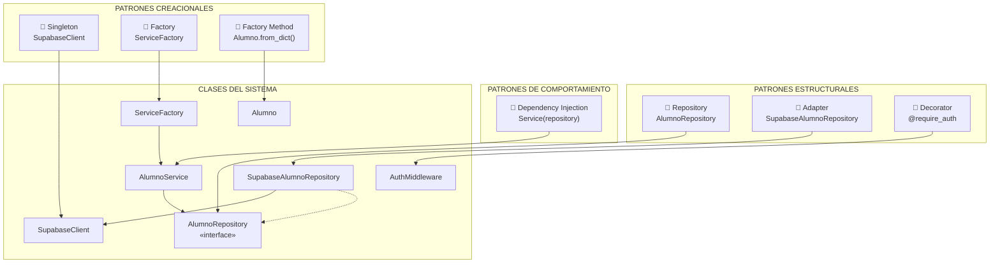

---

## 📊 Resumen del Modelado

### Modelo de Datos

| Aspecto | Decisión |
|---------|----------|
| **Entidad Principal** | `Alumno` (nombre, apellido, DNI) |
| **Identificador** | UUID v4 (seguro, distribuido) |
| **Timestamps** | `created_at`, `updated_at` (UTC) |
| **Constraint Principal** | DNI único |
| **RLS** | Solo usuarios autenticados |

### Clases del Sistema

| Capa | Clases | Patrones |
|------|--------|----------|
| **Dominio** | `Alumno`, `AlumnoRepository` | Factory Method, Repository |
| **Aplicación** | `AlumnoService` | Dependency Injection |
| **Infraestructura** | `SupabaseAlumnoRepository`, `SupabaseClient` | Adapter, Singleton |
| **Presentación** | `FlaskApp`, `AuthMiddleware`, `ServiceFactory` | Decorator, Factory |

---

> **Estado del Documento**: Pendiente de Aprobación  
> **Siguiente Paso**: Implementación de código (Fase 4)
