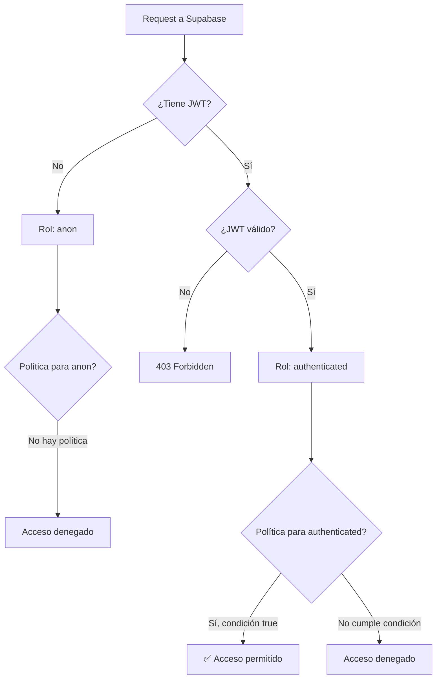

# 📚 Manual de Base de Datos

> **Proyecto**: App Didáctica CRUD de Alumnos  
> **Base de Datos**: Supabase (PostgreSQL 15+)  
> **Fase**: 3.5 (Estrategia de Persistencia)  
> **Fecha**: 2025-12-22  
> **Estado**: Aprobado

---

## 📑 Índice

1. [Introducción a Supabase](#1-introducción-a-supabase)
2. [Configuración del Proyecto](#2-configuración-del-proyecto)
3. [Estructura de la Base de Datos](#3-estructura-de-la-base-de-datos)
4. [Row Level Security (RLS)](#4-row-level-security-rls)
5. [Conexión desde la Aplicación](#5-conexión-desde-la-aplicación)
6. [Operaciones CRUD](#6-operaciones-crud)
7. [Mantenimiento y Troubleshooting](#7-mantenimiento-y-troubleshooting)

---

## 1. Introducción a Supabase

### 1.1 ¿Qué es Supabase?

Supabase es una plataforma Backend-as-a-Service (BaaS) open source que proporciona:

| Servicio | Descripción | Lo usamos |
|----------|-------------|-----------|
| **Database** | PostgreSQL completo | ✅ Sí |
| **Auth** | Autenticación (email, OAuth) | ✅ Sí |
| **Storage** | Almacenamiento de archivos | ❌ No (MVP) |
| **Realtime** | Suscripciones en tiempo real | ❌ No (MVP) |
| **Edge Functions** | Funciones serverless | ❌ No |

### 1.2 ¿Por qué Supabase?

| Razón | Explicación |
|-------|-------------|
| **Gratuito** | Tier free generoso (500 MB, 2 proyectos) |
| **PostgreSQL real** | Base de datos relacional completa, no "lite" |
| **Auth incluido** | No necesitamos implementar autenticación |
| **Panel visual** | UI para ver/editar datos sin SQL |
| **API automática** | Genera REST y realtime automáticamente |
| **Didáctico** | Enseña conceptos SQL reales |

### 1.3 ¿Por qué NO alternativas?

| Alternativa | Por qué NO |
|-------------|------------|
| **Firebase** | NoSQL (Firestore) - menos didáctico para SQL |
| **MongoDB Atlas** | NoSQL - no enseña relacional |
| **PlanetScale** | MySQL, menos features que PostgreSQL |
| **SQLite local** | No funciona en serverless (Vercel) |
| **Railway** | Gratuito pero con límites menores |

---

## 2. Configuración del Proyecto

### 2.1 Crear Proyecto en Supabase

1. **Ir a** [https://app.supabase.com](https://app.supabase.com)
2. **Crear cuenta** (o login con GitHub)
3. **New Project**:
   - Organization: (crear o seleccionar)
   - Project name: `app-didactica-crud`
   - Database Password: **GUARDAR EN LUGAR SEGURO**
   - Region: `South America (São Paulo)` (más cercano a Argentina)
4. **Esperar** ~2 minutos a que se aprovisione

### 2.2 Obtener Credenciales

Ir a **Settings → API** y copiar:

```
┌─────────────────────────────────────────────────────────────────────────┐
│  CREDENCIALES SUPABASE                                                  │
├─────────────────────────────────────────────────────────────────────────┤
│                                                                         │
│  Project URL:                                                           │
│  https://[tu-proyecto-id].supabase.co                                   │
│                                                                         │
│  API Key (anon public):                                                 │
│  eyJhbGciOiJIUzI1NiIsInR5cCI6IkpXVCJ9...                                │
│  ⚠️ Esta key es PÚBLICA pero está protegida por RLS                    │
│                                                                         │
│  JWT Secret (service_role):                                             │
│  ⚠️ NUNCA exponer esta key - solo para backend                         │
│                                                                         │
└─────────────────────────────────────────────────────────────────────────┘
```

### 2.3 Configurar Variables de Entorno

Crear archivo `.env` en la raíz del proyecto:

```env
# ═══════════════════════════════════════════════════════════════
# SUPABASE - Credenciales
# ═══════════════════════════════════════════════════════════════

# URL del proyecto (no es secreto, pero no hardcodear)
SUPABASE_URL=https://[tu-proyecto-id].supabase.co

# API Key pública (anon) - protegida por RLS
SUPABASE_KEY=eyJhbGciOiJIUzI1NiIsInR5cCI6IkpXVCJ9...

# JWT Secret - SOLO para validación backend
# NO exponer en frontend ni en código
SUPABASE_JWT_SECRET=tu-jwt-secret-aqui

# ═══════════════════════════════════════════════════════════════
# FLASK - Configuración
# ═══════════════════════════════════════════════════════════════

FLASK_ENV=development
FLASK_DEBUG=1
FLASK_SECRET_KEY=genera-una-key-segura-aqui
```

**⚠️ IMPORTANTE**: El archivo `.env` está en `.gitignore` y NUNCA debe subirse al repositorio.

### 2.4 Ejecutar Script de Inicialización

1. Ir a **SQL Editor** en el panel de Supabase
2. Click en **New Query**
3. Copiar y pegar el contenido de `database/init.sql`
4. Click en **Run** (o Ctrl+Enter)
5. Verificar mensaje de éxito en la consola

---

## 3. Estructura de la Base de Datos

### 3.1 Diagrama Entidad-Relación

```
┌─────────────────────────────────────────────────────────────────┐
│                         TABLA: alumnos                          │
├─────────────────────────────────────────────────────────────────┤
│  COLUMNA       │  TIPO           │  CONSTRAINTS                 │
├─────────────────────────────────────────────────────────────────┤
│  id            │  UUID           │  PK, DEFAULT gen_random_uuid()│
│  nombre        │  VARCHAR(100)   │  NOT NULL, CHECK(length > 0) │
│  apellido      │  VARCHAR(100)   │  NOT NULL, CHECK(length > 0) │
│  dni           │  VARCHAR(20)    │  NOT NULL, UNIQUE            │
│  created_at    │  TIMESTAMPTZ    │  NOT NULL, DEFAULT NOW()     │
│  updated_at    │  TIMESTAMPTZ    │  NOT NULL, DEFAULT NOW()     │
└─────────────────────────────────────────────────────────────────┘
```

### 3.2 Diccionario de Datos

| Campo | Tipo PostgreSQL | Tipo Python | Descripción |
|-------|-----------------|-------------|-------------|
| `id` | `UUID` | `str` | Identificador único, generado automáticamente |
| `nombre` | `VARCHAR(100)` | `str` | Nombre del alumno (máx 100 chars) |
| `apellido` | `VARCHAR(100)` | `str` | Apellido del alumno (máx 100 chars) |
| `dni` | `VARCHAR(20)` | `str` | DNI único en el sistema |
| `created_at` | `TIMESTAMPTZ` | `datetime` | Fecha/hora de creación (UTC) |
| `updated_at` | `TIMESTAMPTZ` | `datetime` | Fecha/hora última modificación (UTC) |

### 3.3 Constraints (Restricciones)

| Nombre | Tipo | Campo(s) | Descripción |
|--------|------|----------|-------------|
| `alumnos_pkey` | PRIMARY KEY | `id` | Clave primaria |
| `alumnos_dni_key` | UNIQUE | `dni` | DNI único |
| `chk_nombre_no_vacio` | CHECK | `nombre` | Nombre no puede estar vacío |
| `chk_apellido_no_vacio` | CHECK | `apellido` | Apellido no puede estar vacío |
| `chk_dni_no_vacio` | CHECK | `dni` | DNI no puede estar vacío |

### 3.4 Índices

| Nombre | Campo(s) | Tipo | Propósito |
|--------|----------|------|-----------|
| `alumnos_pkey` | `id` | B-tree | Búsqueda por ID (automático) |
| `alumnos_dni_key` | `dni` | B-tree | Búsqueda por DNI (automático por UNIQUE) |
| `idx_alumnos_apellido` | `apellido` | B-tree | Ordenamiento por apellido |
| `idx_alumnos_apellido_nombre` | `apellido, nombre` | B-tree | Búsqueda por nombre completo |
| `idx_alumnos_apellido_lower` | `LOWER(apellido)` | B-tree | Búsqueda case-insensitive |

### 3.5 Trigger

| Nombre | Evento | Función | Descripción |
|--------|--------|---------|-------------|
| `trigger_alumnos_updated_at` | BEFORE UPDATE | `trigger_set_updated_at()` | Actualiza `updated_at` automáticamente |

---

## 4. Row Level Security (RLS)

### 4.1 ¿Qué es RLS?

Row Level Security permite definir **políticas de acceso a nivel de fila**. Aunque alguien tenga la API key, solo puede acceder a los datos según las políticas definidas.

```
┌─────────────────────────────────────────────────────────────────┐
│                   SEGURIDAD EN CAPAS                            │
├─────────────────────────────────────────────────────────────────┤
│                                                                 │
│   CAPA 1: API Key                                               │
│   └── Identifica la aplicación                                  │
│                                                                 │
│   CAPA 2: JWT (Token de usuario)                                │
│   └── Identifica al usuario autenticado                         │
│                                                                 │
│   CAPA 3: RLS (Row Level Security)                              │
│   └── Determina qué filas puede ver/modificar                  │
│                                                                 │
│   Sin RLS, la API key da acceso a TODA la tabla                │
│   Con RLS, solo se accede según las políticas                  │
│                                                                 │
└─────────────────────────────────────────────────────────────────┘
```

### 4.2 Políticas Configuradas

| Política | Operación | Rol | Condición | Descripción |
|----------|-----------|-----|-----------|-------------|
| Leer alumnos | SELECT | `authenticated` | `true` | Solo usuarios logueados pueden ver |
| Crear alumnos | INSERT | `authenticated` | `true` | Solo usuarios logueados pueden crear |
| Actualizar alumnos | UPDATE | `authenticated` | `true` | Solo usuarios logueados pueden editar |
| Eliminar alumnos | DELETE | `authenticated` | `true` | Solo usuarios logueados pueden borrar |

### 4.3 Roles en Supabase

| Rol | Descripción | Cuándo se usa |
|-----|-------------|---------------|
| `anon` | Usuario anónimo (no logueado) | Requests sin JWT |
| `authenticated` | Usuario autenticado | Requests con JWT válido |
| `service_role` | Acceso total (bypass RLS) | Solo backend con secret key |

### 4.4 Cómo Funciona



---

## 5. Conexión desde la Aplicación

### 5.1 Dependencias Python

```txt
# requirements.txt
supabase>=2.0.0
python-dotenv>=1.0.0
```

### 5.2 Cliente Supabase (Patrón Singleton)

```python
# infrastructure/supabase_client.py (pseudocódigo - no implementar aún)

import os
from supabase import create_client, Client
from threading import Lock

_client: Client = None
_lock = Lock()

def get_supabase_client() -> Client:
    """
    Retorna instancia singleton del cliente Supabase.
    
    POR QUÉ SINGLETON:
    - Una sola conexión, no una por request
    - Eficiente en memoria
    - Thread-safe con Lock
    """
    global _client
    
    if _client is None:
        with _lock:
            if _client is None:
                url = os.getenv('SUPABASE_URL')
                key = os.getenv('SUPABASE_KEY')
                
                if not url or not key:
                    raise EnvironmentError(
                        "Variables SUPABASE_URL y SUPABASE_KEY requeridas"
                    )
                
                _client = create_client(url, key)
    
    return _client
```

### 5.3 Cliente JavaScript (Frontend)

```javascript
// static/js/supabase-config.js (pseudocódigo)

// Estas variables se inyectan en el HTML o se leen de configuración
const SUPABASE_URL = 'https://[tu-proyecto].supabase.co';
const SUPABASE_ANON_KEY = 'eyJhbGci...';

// Crear cliente
const supabase = window.supabase.createClient(SUPABASE_URL, SUPABASE_ANON_KEY);
```

---

## 6. Operaciones CRUD

### 6.1 Desde el Panel de Supabase

#### Ver datos
1. Ir a **Table Editor** → `alumnos`
2. Los datos se muestran en formato tabla
3. Click en una fila para ver detalles

#### Insertar
1. Click **Insert** → **Insert row**
2. Completar campos (id se genera solo)
3. **Save**

#### Editar
1. Click en la fila
2. Modificar campos
3. **Save**

#### Eliminar
1. Seleccionar fila(s)
2. Click **Delete** → Confirmar

### 6.2 Desde SQL Editor

```sql
-- LISTAR todos los alumnos
SELECT * FROM alumnos ORDER BY apellido;

-- BUSCAR por DNI
SELECT * FROM alumnos WHERE dni = '12345678';

-- INSERTAR nuevo alumno
INSERT INTO alumnos (nombre, apellido, dni)
VALUES ('Juan', 'Pérez', '11111111')
RETURNING *;

-- ACTUALIZAR alumno
UPDATE alumnos 
SET nombre = 'Juan Carlos', apellido = 'Pérez García'
WHERE id = 'uuid-del-alumno'
RETURNING *;

-- ELIMINAR alumno
DELETE FROM alumnos WHERE id = 'uuid-del-alumno';

-- CONTAR alumnos
SELECT COUNT(*) FROM alumnos;
```

### 6.3 Desde la API REST (Postman/curl)

```bash
# Listar alumnos (GET)
curl 'https://[proyecto].supabase.co/rest/v1/alumnos?select=*' \
  -H "apikey: [ANON_KEY]" \
  -H "Authorization: Bearer [JWT_TOKEN]"

# Crear alumno (POST)
curl 'https://[proyecto].supabase.co/rest/v1/alumnos' \
  -H "apikey: [ANON_KEY]" \
  -H "Authorization: Bearer [JWT_TOKEN]" \
  -H "Content-Type: application/json" \
  -H "Prefer: return=representation" \
  -d '{"nombre":"Juan","apellido":"Pérez","dni":"99999999"}'

# Actualizar alumno (PATCH)
curl 'https://[proyecto].supabase.co/rest/v1/alumnos?id=eq.[UUID]' \
  -X PATCH \
  -H "apikey: [ANON_KEY]" \
  -H "Authorization: Bearer [JWT_TOKEN]" \
  -H "Content-Type: application/json" \
  -d '{"nombre":"Juan Carlos"}'

# Eliminar alumno (DELETE)
curl 'https://[proyecto].supabase.co/rest/v1/alumnos?id=eq.[UUID]' \
  -X DELETE \
  -H "apikey: [ANON_KEY]" \
  -H "Authorization: Bearer [JWT_TOKEN]"
```

---

## 7. Mantenimiento y Troubleshooting

### 7.1 Verificar Estado de la Base de Datos

```sql
-- Verificar que la tabla existe
SELECT EXISTS (
    SELECT FROM information_schema.tables 
    WHERE table_name = 'alumnos'
);

-- Ver estructura de la tabla
SELECT column_name, data_type, is_nullable, column_default
FROM information_schema.columns
WHERE table_name = 'alumnos';

-- Ver políticas RLS
SELECT * FROM pg_policies WHERE tablename = 'alumnos';

-- Ver índices
SELECT indexname, indexdef 
FROM pg_indexes 
WHERE tablename = 'alumnos';

-- Ver triggers
SELECT trigger_name, event_manipulation, action_statement
FROM information_schema.triggers
WHERE event_object_table = 'alumnos';
```

### 7.2 Errores Comunes y Soluciones

| Error | Causa | Solución |
|-------|-------|----------|
| `new row violates RLS` | Usuario no autenticado | Verificar JWT en request |
| `duplicate key violates unique constraint "alumnos_dni_key"` | DNI duplicado | Usar DNI diferente |
| `null value in column "nombre" violates not-null` | Campo requerido vacío | Enviar todos los campos |
| `permission denied for table alumnos` | RLS no configurado o sin política | Ejecutar script de RLS |
| `JWT expired` | Token expirado | Refresh token o re-login |

### 7.3 Resetear Base de Datos (Desarrollo)

```sql
-- ⚠️ PELIGRO: Elimina TODOS los datos
-- Solo usar en desarrollo

-- Eliminar todos los alumnos
TRUNCATE TABLE alumnos;

-- O eliminar y recrear la tabla
DROP TABLE IF EXISTS alumnos CASCADE;
-- Luego ejecutar init.sql nuevamente
```

### 7.4 Backup de Datos

**Desde el Panel:**
1. Ir a **Settings** → **Database**
2. **Database Backup** → **Create Backup**

**Desde SQL:**
```sql
-- Exportar a JSON (ver en results)
SELECT json_agg(alumnos) FROM alumnos;
```

### 7.5 Monitoreo

- **Dashboard** → Ver uso de API, storage, bandwidth
- **Logs** → Ver requests y errores
- **API** → Ver documentación auto-generada

---

## 📊 Resumen de Configuración

| Aspecto | Valor |
|---------|-------|
| **Proveedor** | Supabase |
| **Motor** | PostgreSQL 15+ |
| **Tabla** | `alumnos` |
| **Campos** | id, nombre, apellido, dni, created_at, updated_at |
| **RLS** | Habilitado (solo authenticated) |
| **Trigger** | Auto-update de updated_at |
| **Índices** | id, dni, apellido, apellido+nombre |

---

## 📎 Archivos Relacionados

| Archivo | Propósito |
|---------|-----------|
| `database/init.sql` | Script de inicialización |
| `.env.example` | Template de variables de entorno |
| `infrastructure/supabase_client.py` | Cliente Python (futuro) |
| `static/js/supabase-config.js` | Cliente JavaScript (futuro) |

---

> **Documento**: Manual de Base de Datos  
> **Versión**: 1.0.0  
> **Última actualización**: 2025-12-22
