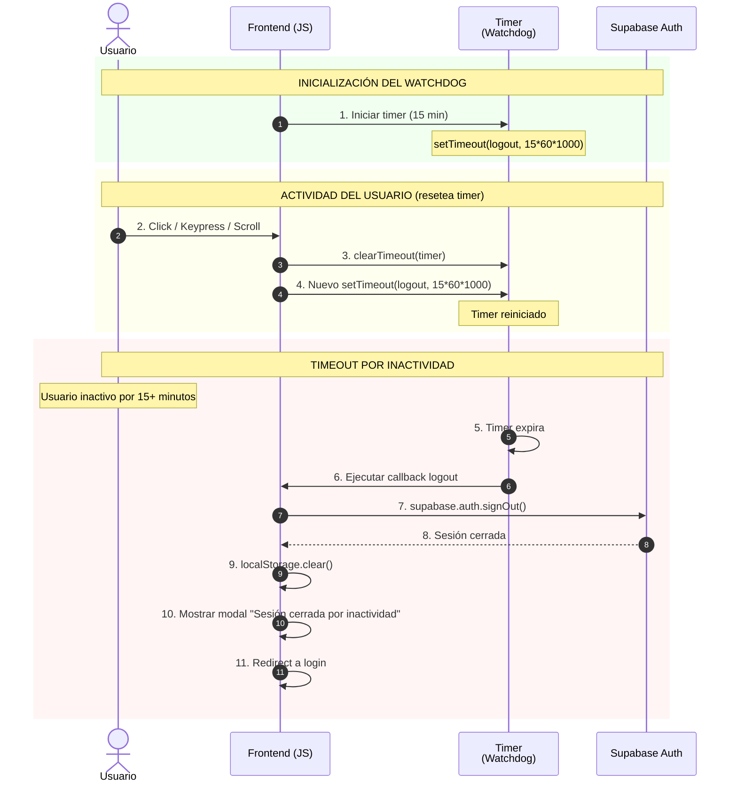
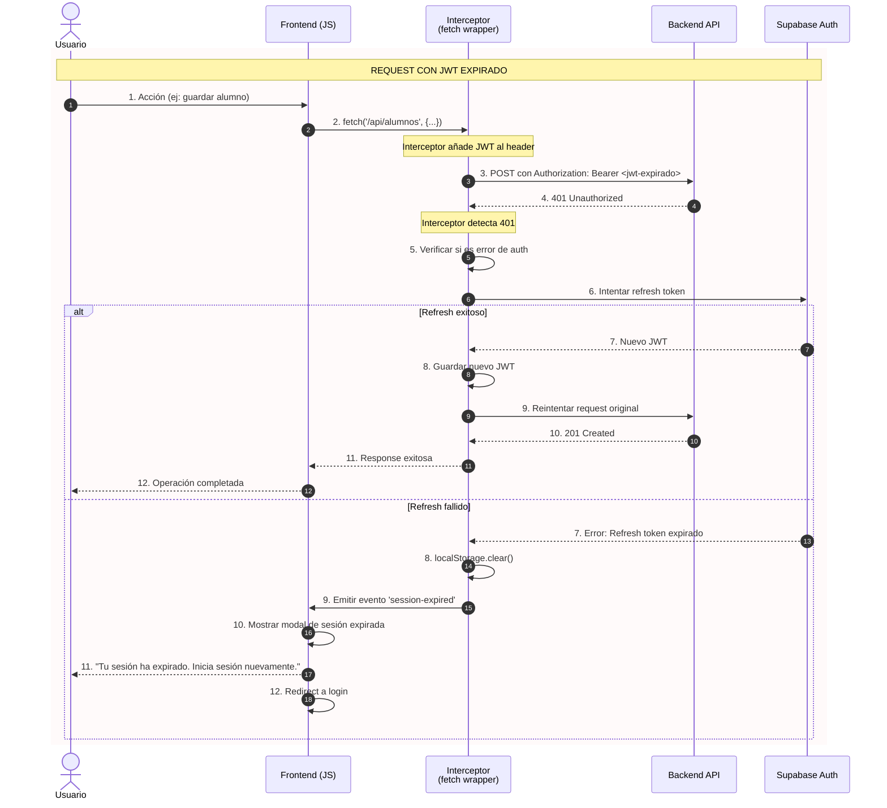
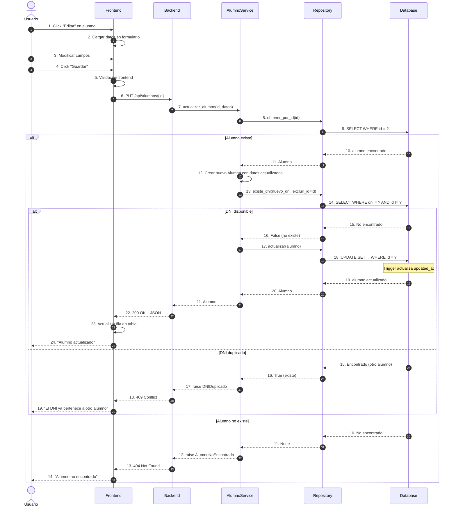
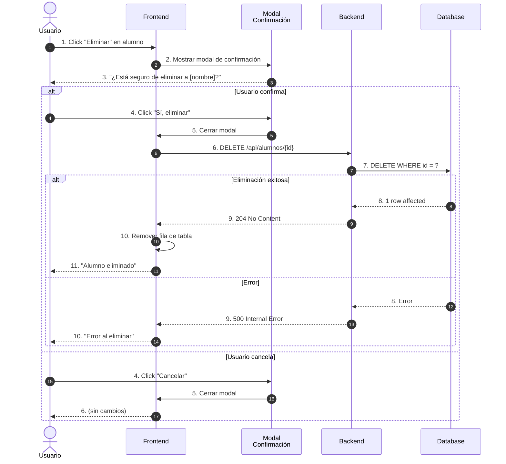
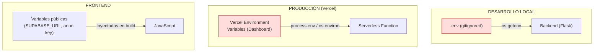
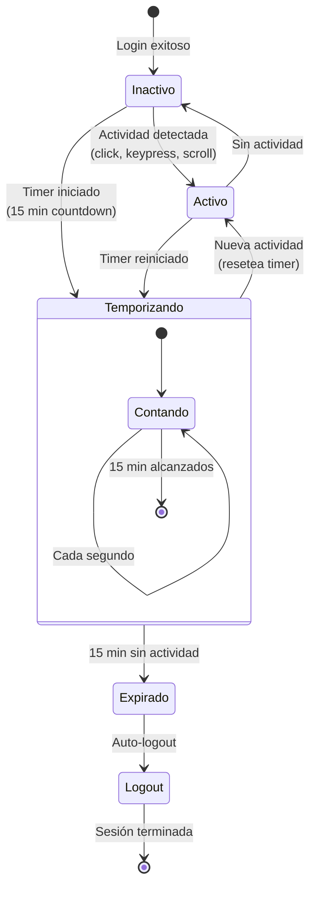
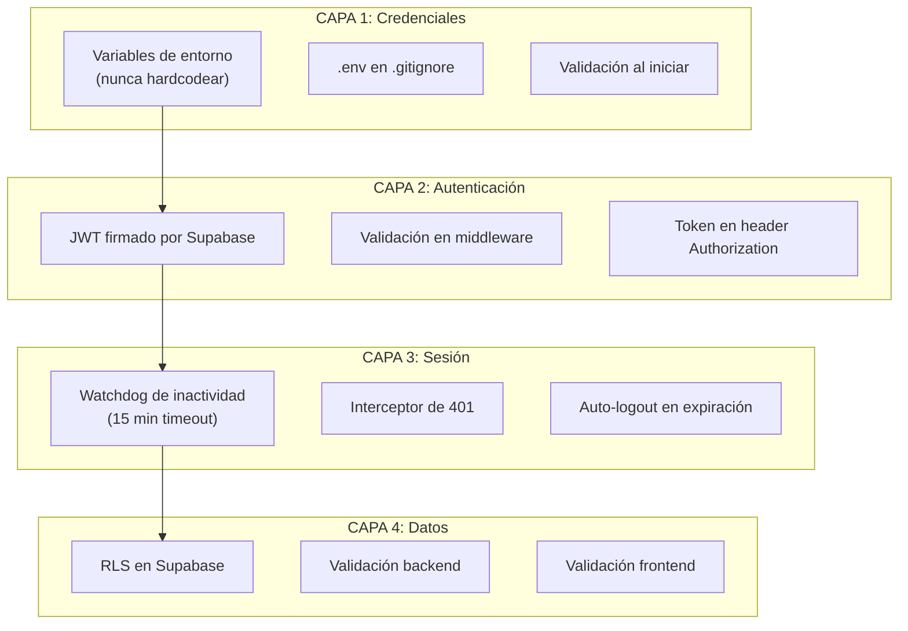

# 🔌 Especificación de API y Diseño Dinámico

> **Proyecto**: App Didáctica CRUD de Alumnos  
> **Fase**: 3-C (API y Dinámica)  
> **Fecha**: 2025-12-22  
> **Estado**: Pendiente de Aprobación

---

## 📑 Índice

1. [Mapa de Endpoints (Trazabilidad Total)](#1-mapa-de-endpoints-trazabilidad-total)
2. [Diagramas de Secuencia](#2-diagramas-de-secuencia)
3. [Seguridad de Diseño y Sesión](#3-seguridad-de-diseño-y-sesión)
4. [Contratos de API (Request/Response)](#4-contratos-de-api-requestresponse)
5. [Códigos de Error Estandarizados](#5-códigos-de-error-estandarizados)

---

## 1. Mapa de Endpoints (Trazabilidad Total)

### 1.1 Tabla de Endpoints Completa

| Método | Endpoint | Descripción | Auth | Módulo | Historia Usuario | Caso de Uso |
|--------|----------|-------------|------|--------|------------------|-------------|
| `GET` | `/api/alumnos` | Listar todos los alumnos | ✅ | ALUMNOS | HU-002 | CU-001 |
| `POST` | `/api/alumnos` | Crear nuevo alumno | ✅ | ALUMNOS | HU-001 | CU-001 |
| `GET` | `/api/alumnos/{id}` | Obtener alumno por ID | ✅ | ALUMNOS | HU-002 | CU-001 |
| `PUT` | `/api/alumnos/{id}` | Actualizar alumno | ✅ | ALUMNOS | HU-003 | CU-001 |
| `DELETE` | `/api/alumnos/{id}` | Eliminar alumno | ✅ | ALUMNOS | HU-004 | CU-001 |
| `GET` | `/api/health` | Estado del servicio | ❌ | SISTEMA | - | - |

### 1.2 Detalle con Trazabilidad Total

---

#### 📍 GET /api/alumnos

```yaml
Endpoint: GET /api/alumnos
Descripción: Retorna la lista de todos los alumnos registrados
Autenticación: Requerida (JWT Bearer Token)

Trazabilidad:
  Módulo: ALUMNOS
  Historia de Usuario: HU-002 (Ver Lista de Alumnos)
  Caso de Uso: CU-001 (Gestionar Alumno - CRUD)
  Requisitos Funcionales: RF-002
  Requisitos No Funcionales: RNF-002, RNF-006

Criterios de Aceptación:
  - ✅ Retorna array JSON con todos los alumnos
  - ✅ Cada alumno incluye: id, nombre, apellido, dni
  - ✅ Si no hay alumnos, retorna array vacío []
  - ✅ Ordenado por apellido (A-Z)
  - ✅ Retorna 401 si JWT inválido o expirado
  - ✅ Tiempo de respuesta < 500ms

Request:
  Headers:
    Authorization: Bearer <jwt_token>

Response (200 OK):
  Content-Type: application/json
  Body: [
    {
      "id": "uuid",
      "nombre": "string",
      "apellido": "string",
      "dni": "string",
      "created_at": "ISO8601",
      "updated_at": "ISO8601"
    }
  ]

Response (401 Unauthorized):
  Body: { "error": "Token inválido o expirado" }
```

---

#### 📍 POST /api/alumnos

```yaml
Endpoint: POST /api/alumnos
Descripción: Crea un nuevo alumno en el sistema
Autenticación: Requerida (JWT Bearer Token)

Trazabilidad:
  Módulo: ALUMNOS
  Historia de Usuario: HU-001 (Registrar Alumno)
  Caso de Uso: CU-001 (Gestionar Alumno - CRUD)
  Requisitos Funcionales: RF-001, RF-005, RF-010
  Requisitos No Funcionales: RNF-001, RNF-002

Criterios de Aceptación:
  - ✅ Crea alumno con nombre, apellido, DNI
  - ✅ Genera UUID automáticamente
  - ✅ Valida campos requeridos (400 si faltan)
  - ✅ Valida DNI único (409 si duplicado)
  - ✅ Retorna alumno creado con 201 Created
  - ✅ Retorna 401 si JWT inválido

Request:
  Headers:
    Authorization: Bearer <jwt_token>
    Content-Type: application/json
  Body:
    {
      "nombre": "string (requerido, 1-100 chars)",
      "apellido": "string (requerido, 1-100 chars)",
      "dni": "string (requerido, único, 1-20 chars)"
    }

Response (201 Created):
  Content-Type: application/json
  Body: {
    "id": "uuid-generado",
    "nombre": "string",
    "apellido": "string",
    "dni": "string",
    "created_at": "ISO8601",
    "updated_at": "ISO8601"
  }

Response (400 Bad Request):
  Body: { 
    "error": "Datos inválidos",
    "detalles": {
      "nombre": "El nombre es requerido",
      "dni": "El DNI debe tener entre 1 y 20 caracteres"
    }
  }

Response (409 Conflict):
  Body: { "error": "El DNI ya está registrado" }

Response (401 Unauthorized):
  Body: { "error": "Token inválido o expirado" }
```

---

#### 📍 GET /api/alumnos/{id}

```yaml
Endpoint: GET /api/alumnos/{id}
Descripción: Obtiene un alumno específico por su ID
Autenticación: Requerida (JWT Bearer Token)

Trazabilidad:
  Módulo: ALUMNOS
  Historia de Usuario: HU-002 (Ver Lista de Alumnos)
  Caso de Uso: CU-001 (Gestionar Alumno - CRUD)
  Requisitos Funcionales: RF-002
  Requisitos No Funcionales: RNF-002

Criterios de Aceptación:
  - ✅ Retorna alumno si existe
  - ✅ Retorna 404 si no existe
  - ✅ Valida formato UUID del ID
  - ✅ Retorna 401 si JWT inválido

Request:
  Headers:
    Authorization: Bearer <jwt_token>
  Path Parameters:
    id: UUID del alumno

Response (200 OK):
  Body: {
    "id": "uuid",
    "nombre": "string",
    "apellido": "string",
    "dni": "string",
    "created_at": "ISO8601",
    "updated_at": "ISO8601"
  }

Response (404 Not Found):
  Body: { "error": "Alumno no encontrado" }

Response (400 Bad Request):
  Body: { "error": "ID inválido: debe ser UUID" }
```

---

#### 📍 PUT /api/alumnos/{id}

```yaml
Endpoint: PUT /api/alumnos/{id}
Descripción: Actualiza los datos de un alumno existente
Autenticación: Requerida (JWT Bearer Token)

Trazabilidad:
  Módulo: ALUMNOS
  Historia de Usuario: HU-003 (Editar Alumno)
  Caso de Uso: CU-001 (Gestionar Alumno - CRUD), Flujo Alternativo A
  Requisitos Funcionales: RF-003, RF-005, RF-010
  Requisitos No Funcionales: RNF-001, RNF-002

Criterios de Aceptación:
  - ✅ Actualiza nombre, apellido y/o DNI
  - ✅ Valida que alumno exista (404 si no)
  - ✅ Valida DNI único entre OTROS alumnos (409 si duplicado)
  - ✅ Actualiza campo updated_at automáticamente
  - ✅ Retorna alumno actualizado
  - ✅ Retorna 401 si JWT inválido

Request:
  Headers:
    Authorization: Bearer <jwt_token>
    Content-Type: application/json
  Path Parameters:
    id: UUID del alumno
  Body:
    {
      "nombre": "string (requerido)",
      "apellido": "string (requerido)",
      "dni": "string (requerido)"
    }

Response (200 OK):
  Body: {
    "id": "uuid",
    "nombre": "string-actualizado",
    "apellido": "string-actualizado",
    "dni": "string-actualizado",
    "created_at": "ISO8601",
    "updated_at": "ISO8601-nuevo"
  }

Response (404 Not Found):
  Body: { "error": "Alumno no encontrado" }

Response (409 Conflict):
  Body: { "error": "El DNI ya está registrado por otro alumno" }
```

---

#### 📍 DELETE /api/alumnos/{id}

```yaml
Endpoint: DELETE /api/alumnos/{id}
Descripción: Elimina un alumno del sistema
Autenticación: Requerida (JWT Bearer Token)

Trazabilidad:
  Módulo: ALUMNOS
  Historia de Usuario: HU-004 (Eliminar Alumno)
  Caso de Uso: CU-001 (Gestionar Alumno - CRUD), Flujo Alternativo B
  Requisitos Funcionales: RF-004, RF-009
  Requisitos No Funcionales: RNF-002

Criterios de Aceptación:
  - ✅ Elimina alumno de la base de datos (hard delete)
  - ✅ Retorna 204 No Content si éxito
  - ✅ Retorna 404 si alumno no existe
  - ✅ Retorna 401 si JWT inválido

Request:
  Headers:
    Authorization: Bearer <jwt_token>
  Path Parameters:
    id: UUID del alumno

Response (204 No Content):
  Body: (vacío)

Response (404 Not Found):
  Body: { "error": "Alumno no encontrado" }
```

---

#### 📍 GET /api/health

```yaml
Endpoint: GET /api/health
Descripción: Verifica el estado del servicio (healthcheck)
Autenticación: No requerida

Trazabilidad:
  Módulo: SISTEMA
  Historia de Usuario: N/A (operacional)
  Requisitos No Funcionales: Monitoreo

Criterios de Aceptación:
  - ✅ Retorna 200 si el servicio está funcionando
  - ✅ Incluye timestamp del servidor (UTC)
  - ✅ Tiempo de respuesta < 100ms

Request:
  Headers: (ninguno requerido)

Response (200 OK):
  Body: {
    "status": "healthy",
    "timestamp": "ISO8601-UTC",
    "version": "1.0.0"
  }
```

---

### 1.3 Matriz de Trazabilidad Completa

| Endpoint | Módulo | HU | CU | RF | RNF |
|----------|--------|----|----|----|----|
| `GET /api/alumnos` | ALUMNOS | HU-002 | CU-001 | RF-002 | RNF-002, RNF-006 |
| `POST /api/alumnos` | ALUMNOS | HU-001 | CU-001 | RF-001, RF-005, RF-010 | RNF-001, RNF-002 |
| `GET /api/alumnos/{id}` | ALUMNOS | HU-002 | CU-001 | RF-002 | RNF-002 |
| `PUT /api/alumnos/{id}` | ALUMNOS | HU-003 | CU-001.A | RF-003, RF-005, RF-010 | RNF-001, RNF-002 |
| `DELETE /api/alumnos/{id}` | ALUMNOS | HU-004 | CU-001.B | RF-004, RF-009 | RNF-002 |
| `GET /api/health` | SISTEMA | - | - | - | Monitoreo |

---

## 2. Diagramas de Secuencia

### 2.1 Flujo Completo: Login y Operación CRUD


### 2.2 Flujo: Watchdog de Inactividad



### 2.3 Flujo: Intercepción de 401 (Sesión Expirada)



### 2.4 Flujo: Editar Alumno (Completo)



### 2.5 Flujo: Eliminar Alumno (con Confirmación)



---

## 3. Seguridad de Diseño y Sesión

### 3.1 Gestión de API Keys y Secretos

```
╔══════════════════════════════════════════════════════════════════════════════╗
║                     GESTIÓN DE CREDENCIALES Y SECRETOS                       ║
╠══════════════════════════════════════════════════════════════════════════════╣
║                                                                              ║
║  REGLA FUNDAMENTAL: NUNCA HARDCODEAR CREDENCIALES                           ║
║                                                                              ║
║  ❌ PROHIBIDO:                                                               ║
║     SUPABASE_KEY = "eyJhbGciOiJIUzI1NiIsInR5cCI6IkpXVCJ9..."                ║
║                                                                              ║
║  ✅ OBLIGATORIO:                                                             ║
║     SUPABASE_KEY = os.getenv('SUPABASE_KEY')                                ║
║                                                                              ║
╚══════════════════════════════════════════════════════════════════════════════╝
```

#### 3.1.1 Variables de Entorno Requeridas

| Variable | Dónde se usa | Tipo | Sensibilidad |
|----------|--------------|------|--------------|
| `SUPABASE_URL` | Backend + Frontend | URL | 🟡 Pública (pero no hardcodear) |
| `SUPABASE_KEY` | Backend + Frontend | String | 🟡 anon key (pública pero no exponer) |
| `SUPABASE_JWT_SECRET` | Backend (validación) | String | 🔴 SECRETO (nunca exponer) |
| `FLASK_SECRET_KEY` | Backend (sessions) | String | 🔴 SECRETO |

#### 3.1.2 Arquitectura de Secretos



#### 3.1.3 Flujo de Configuración

```python
# ═══════════════════════════════════════════════════════════════
# PATRÓN: Carga segura de configuración
# Archivo: infrastructure/config.py
# ═══════════════════════════════════════════════════════════════

import os
from typing import Optional

class Config:
    """
    Configuración centralizada con validación.
    
    POR QUÉ CLASE Y NO DICCIONARIO:
    - Validación en tiempo de carga
    - Errores claros si falta configuración
    - Tipado estático para IDEs
    """
    
    def __init__(self):
        self.supabase_url = self._get_required('SUPABASE_URL')
        self.supabase_key = self._get_required('SUPABASE_KEY')
        self.supabase_jwt_secret = self._get_required('SUPABASE_JWT_SECRET')
        self.flask_secret = self._get_required('FLASK_SECRET_KEY')
        self.debug = os.getenv('FLASK_DEBUG', 'false').lower() == 'true'
    
    def _get_required(self, key: str) -> str:
        """
        Obtiene variable requerida o falla explícitamente.
        
        POR QUÉ FALLAR RÁPIDO:
        - Mejor descubrir la falta de config al iniciar que en runtime
        - Mensaje de error claro indica qué falta
        """
        value = os.getenv(key)
        if not value:
            raise EnvironmentError(
                f"Variable de entorno '{key}' no configurada. "
                f"¿Creaste el archivo .env basándote en .env.example?"
            )
        return value


# Instancia global (se crea al importar)
# POR QUÉ AQUÍ: Validación temprana, falla en import si falta config
config = Config()
```

---

### 3.2 Lógica de Watchdog (Timeout por Inactividad)

#### 3.2.1 Diagrama de Estados del Watchdog



#### 3.2.2 Especificación Técnica del Watchdog

```yaml
Watchdog de Inactividad:
  Nombre: InactivityWatchdog
  Ubicación: Frontend (JavaScript)
  
  Configuración:
    TIMEOUT: 15 minutos (900,000 ms)
    EVENTOS_ACTIVIDAD:
      - click
      - keypress
      - scroll
      - mousemove
      - touchstart
  
  Comportamiento:
    1. Al detectar login exitoso:
       - Iniciar timer de 15 minutos
       - Registrar listeners para eventos de actividad
    
    2. Al detectar actividad:
       - Cancelar timer actual (clearTimeout)
       - Iniciar nuevo timer de 15 minutos
    
    3. Al expirar timer:
       - Llamar supabase.auth.signOut()
       - Limpiar localStorage
       - Mostrar mensaje "Sesión cerrada por inactividad"
       - Redirigir a pantalla de login
    
    4. Al hacer logout manual:
       - Cancelar timer
       - Remover listeners
  
  Código Pseudocódigo:
    class InactivityWatchdog:
        TIMEOUT_MS = 15 * 60 * 1000  # 15 minutos
        timer = null
        
        start():
            this.resetTimer()
            for event in ['click', 'keypress', 'scroll', 'mousemove']:
                document.addEventListener(event, this.resetTimer)
        
        resetTimer():
            clearTimeout(this.timer)
            this.timer = setTimeout(this.onTimeout, TIMEOUT_MS)
        
        onTimeout():
            supabase.auth.signOut()
            localStorage.clear()
            showModal("Sesión cerrada por inactividad")
            redirect("/login")
        
        stop():
            clearTimeout(this.timer)
            for event in ['click', 'keypress', ...]:
                document.removeEventListener(event, this.resetTimer)
```

#### 3.2.3 Implementación Frontend (Pseudocódigo)

```javascript
// ═══════════════════════════════════════════════════════════════
// WATCHDOG DE INACTIVIDAD - Implementación
// Archivo: static/js/watchdog.js
// ═══════════════════════════════════════════════════════════════

const InactivityWatchdog = {
    // Configuración
    TIMEOUT_MS: 15 * 60 * 1000, // 15 minutos en milisegundos
    ACTIVITY_EVENTS: ['click', 'keypress', 'scroll', 'mousemove', 'touchstart'],
    
    // Estado
    _timer: null,
    _isActive: false,
    
    /**
     * Inicia el watchdog después del login.
     * 
     * POR QUÉ EN FRONTEND:
     * - El backend es stateless, no puede rastrear "última actividad"
     * - El frontend SÍ puede detectar interacciones del usuario
     */
    start() {
        if (this._isActive) return; // Evitar múltiples instancias
        
        this._isActive = true;
        this._resetTimer();
        
        // Registrar listeners (con passive para performance)
        this.ACTIVITY_EVENTS.forEach(event => {
            document.addEventListener(event, this._onActivity.bind(this), { passive: true });
        });
        
        console.log('[Watchdog] Iniciado - Timeout: 15 minutos');
    },
    
    /**
     * Handler para eventos de actividad.
     * Resetea el timer cada vez que el usuario hace algo.
     */
    _onActivity() {
        this._resetTimer();
    },
    
    /**
     * Resetea el timer de inactividad.
     */
    _resetTimer() {
        if (this._timer) {
            clearTimeout(this._timer);
        }
        
        this._timer = setTimeout(() => {
            this._onTimeout();
        }, this.TIMEOUT_MS);
    },
    
    /**
     * Handler cuando el timer expira (15 min sin actividad).
     * Ejecuta logout automático.
     */
    async _onTimeout() {
        console.warn('[Watchdog] Sesión expirada por inactividad');
        
        try {
            await supabase.auth.signOut();
        } catch (error) {
            console.error('[Watchdog] Error en signOut:', error);
        }
        
        // Limpiar estado local
        localStorage.clear();
        sessionStorage.clear();
        
        // Mostrar mensaje al usuario
        alert('Tu sesión ha sido cerrada por inactividad (15 minutos).\n\nPor favor, inicia sesión nuevamente.');
        
        // Redirigir a login
        window.location.href = '/';
    },
    
    /**
     * Detiene el watchdog (llamar en logout manual).
     */
    stop() {
        if (this._timer) {
            clearTimeout(this._timer);
            this._timer = null;
        }
        
        this.ACTIVITY_EVENTS.forEach(event => {
            document.removeEventListener(event, this._onActivity.bind(this));
        });
        
        this._isActive = false;
        console.log('[Watchdog] Detenido');
    }
};
```

---

### 3.3 Protocolo de Intercepción (Frontend)

#### 3.3.1 Diagrama de Decisión: Manejo de Errores HTTP

```mermaid
flowchart TD
    START([Request HTTP]) --> SEND[Enviar request con JWT]
    SEND --> RESPONSE{Código de<br/>respuesta?}
    
    RESPONSE -->|2xx| SUCCESS[✅ Procesar respuesta]
    SUCCESS --> END1([Fin])
    
    RESPONSE -->|401| AUTH_ERROR{¿Es error de<br/>autenticación?}
    AUTH_ERROR -->|Sí| TRY_REFRESH[Intentar refresh token]
    
    TRY_REFRESH --> REFRESH{¿Refresh<br/>exitoso?}
    REFRESH -->|Sí| RETRY[Reintentar request original]
    RETRY --> RESPONSE
    
    REFRESH -->|No| LOGOUT[Ejecutar logout]
    LOGOUT --> SHOW_MSG[Mostrar mensaje<br/>"Sesión expirada"]
    SHOW_MSG --> REDIRECT[Redirect a login]
    REDIRECT --> END2([Fin])
    
    RESPONSE -->|400| CLIENT_ERROR[⚠️ Error de validación]
    CLIENT_ERROR --> SHOW_VALIDATION[Mostrar errores<br/>en formulario]
    SHOW_VALIDATION --> END3([Fin])
    
    RESPONSE -->|404| NOT_FOUND[📭 Recurso no encontrado]
    NOT_FOUND --> SHOW_404[Mostrar mensaje<br/>"No encontrado"]
    SHOW_404 --> END4([Fin])
    
    RESPONSE -->|409| CONFLICT[⚠️ Conflicto<br/>(ej: DNI duplicado)]
    CONFLICT --> SHOW_CONFLICT[Mostrar mensaje<br/>específico]
    SHOW_CONFLICT --> END5([Fin])
    
    RESPONSE -->|5xx| SERVER_ERROR[❌ Error del servidor]
    SERVER_ERROR --> SHOW_500[Mostrar mensaje<br/>genérico + reintentar]
    SHOW_500 --> END6([Fin])
```

#### 3.3.2 Especificación del Interceptor HTTP

```yaml
Interceptor HTTP:
  Nombre: AuthenticatedFetch
  Ubicación: Frontend (JavaScript)
  
  Responsabilidades:
    1. Añadir JWT a todas las requests autenticadas
    2. Detectar respuestas 401 Unauthorized
    3. Intentar refresh de token si es posible
    4. Ejecutar logout si el refresh falla
    5. Proporcionar manejo de errores consistente
  
  Flujo de 401:
    1. Recibir respuesta 401
    2. Verificar si hay refresh token disponible
    3. Si hay refresh token:
       a. Llamar supabase.auth.refreshSession()
       b. Si éxito: guardar nuevo JWT y reintentar request
       c. Si falla: ir a paso 4
    4. Ejecutar logout:
       a. supabase.auth.signOut()
       b. localStorage.clear()
       c. Mostrar mensaje "Sesión expirada"
       d. Redirigir a login
  
  Eventos emitidos:
    - 'auth:expired': Cuando la sesión expira
    - 'auth:refreshed': Cuando el token se refresca exitosamente
    - 'request:error': Para cualquier error HTTP
```

#### 3.3.3 Implementación del Interceptor (Pseudocódigo)

```javascript
// ═══════════════════════════════════════════════════════════════
// INTERCEPTOR HTTP AUTENTICADO
// Archivo: static/js/http.js
// ═══════════════════════════════════════════════════════════════

/**
 * Wrapper de fetch que maneja autenticación automáticamente.
 * 
 * POR QUÉ WRAPPER Y NO FETCH DIRECTO:
 * - Centraliza lógica de autenticación
 * - Manejo consistente de errores 401
 * - Un solo lugar para modificar si cambia la lógica
 */
async function authenticatedFetch(url, options = {}) {
    // Obtener token actual
    const session = await supabase.auth.getSession();
    const token = session?.data?.session?.access_token;
    
    // Si no hay token, redirigir a login
    if (!token) {
        handleSessionExpired('No hay sesión activa');
        throw new Error('No autenticado');
    }
    
    // Añadir headers de autenticación
    const headers = {
        ...options.headers,
        'Authorization': `Bearer ${token}`,
        'Content-Type': 'application/json'
    };
    
    try {
        const response = await fetch(url, { ...options, headers });
        
        // Manejar 401: Sesión expirada
        if (response.status === 401) {
            const refreshed = await tryRefreshSession();
            
            if (refreshed) {
                // Reintentar request con nuevo token
                return authenticatedFetch(url, options);
            } else {
                handleSessionExpired('Token expirado');
                throw new Error('Sesión expirada');
            }
        }
        
        // Manejar otros errores HTTP
        if (!response.ok) {
            const error = await response.json().catch(() => ({}));
            throw new HttpError(response.status, error.message || 'Error desconocido', error);
        }
        
        return response;
        
    } catch (error) {
        if (error instanceof HttpError) throw error;
        
        // Error de red
        console.error('[HTTP] Error de red:', error);
        throw new Error('Error de conexión. Verifica tu internet.');
    }
}

/**
 * Intenta refrescar la sesión con Supabase.
 * @returns {boolean} true si el refresh fue exitoso
 */
async function tryRefreshSession() {
    try {
        const { data, error } = await supabase.auth.refreshSession();
        
        if (error) {
            console.warn('[Auth] Refresh fallido:', error.message);
            return false;
        }
        
        console.log('[Auth] Token refrescado exitosamente');
        return true;
        
    } catch (error) {
        console.error('[Auth] Error en refresh:', error);
        return false;
    }
}

/**
 * Maneja la expiración de sesión.
 * Limpia estado y redirige a login.
 */
function handleSessionExpired(reason) {
    console.warn('[Auth] Sesión expirada:', reason);
    
    // Detener watchdog
    InactivityWatchdog.stop();
    
    // Limpiar todo el estado local
    localStorage.clear();
    sessionStorage.clear();
    
    // Cerrar sesión en Supabase (por si acaso)
    supabase.auth.signOut().catch(() => {});
    
    // Mostrar mensaje
    showToast('Tu sesión ha expirado. Por favor, inicia sesión nuevamente.', 'warning');
    
    // Redirigir después de un breve delay (para que se vea el mensaje)
    setTimeout(() => {
        window.location.href = '/';
    }, 2000);
}

/**
 * Clase para errores HTTP con información estructurada.
 */
class HttpError extends Error {
    constructor(status, message, details = {}) {
        super(message);
        this.status = status;
        this.details = details;
    }
}
```

---

### 3.4 Resumen de Seguridad



| Capa | Componente | Ubicación | Propósito |
|------|------------|-----------|-----------|
| **Credenciales** | Variables de entorno | `.env` / Vercel Dashboard | Proteger secretos |
| **Autenticación** | JWT + Middleware | Backend | Validar identidad |
| **Sesión** | Watchdog + Interceptor | Frontend | Timeout automático |
| **Datos** | RLS + Validaciones | Supabase + Backend + Frontend | Integridad |

---

## 4. Contratos de API (Request/Response)

### 4.1 Formato de Respuesta Estándar

#### Respuesta Exitosa (Objeto)
```json
{
  "id": "uuid",
  "nombre": "string",
  "apellido": "string",
  "dni": "string",
  "created_at": "2025-12-22T12:00:00.000Z",
  "updated_at": "2025-12-22T12:00:00.000Z"
}
```

#### Respuesta Exitosa (Lista)
```json
[
  { "id": "uuid", "nombre": "...", ... },
  { "id": "uuid", "nombre": "...", ... }
]
```

#### Respuesta de Error
```json
{
  "error": "Mensaje de error legible para el usuario",
  "codigo": "ERROR_CODE_INTERNO",
  "detalles": {
    "campo": "Mensaje específico del campo"
  }
}
```

### 4.2 Headers Requeridos

| Header | Valor | Cuándo |
|--------|-------|--------|
| `Authorization` | `Bearer <jwt>` | Todas las rutas protegidas |
| `Content-Type` | `application/json` | POST, PUT con body |
| `Accept` | `application/json` | Todas las requests |

---

## 5. Códigos de Error Estandarizados

### 5.1 Mapeo de Códigos HTTP

| Código | Nombre | Cuándo usar | Ejemplo |
|--------|--------|-------------|---------|
| `200` | OK | GET/PUT exitoso | Listar alumnos, actualizar |
| `201` | Created | POST exitoso | Crear alumno |
| `204` | No Content | DELETE exitoso | Eliminar alumno |
| `400` | Bad Request | Datos inválidos | Campos vacíos, formato incorrecto |
| `401` | Unauthorized | Sin auth o token inválido | JWT expirado |
| `403` | Forbidden | Sin permisos | (futuro: roles) |
| `404` | Not Found | Recurso no existe | Alumno con ID inexistente |
| `409` | Conflict | Conflicto de datos | DNI duplicado |
| `500` | Internal Error | Error del servidor | Error de BD inesperado |

### 5.2 Códigos de Error Internos

| Código Interno | HTTP | Mensaje Usuario | Descripción |
|----------------|------|-----------------|-------------|
| `AUTH_TOKEN_MISSING` | 401 | "Token de autenticación requerido" | No se envió JWT |
| `AUTH_TOKEN_INVALID` | 401 | "Token inválido" | JWT malformado o firma inválida |
| `AUTH_TOKEN_EXPIRED` | 401 | "Sesión expirada" | JWT expiró |
| `VALIDATION_ERROR` | 400 | "Datos inválidos" | Campos no pasan validación |
| `ALUMNO_NOT_FOUND` | 404 | "Alumno no encontrado" | ID no existe |
| `DNI_DUPLICADO` | 409 | "El DNI ya está registrado" | Constraint de unicidad |
| `INTERNAL_ERROR` | 500 | "Error interno del servidor" | Catch-all para errores inesperados |

---

## 📊 Resumen de la Fase 3-C

| Aspecto | Decisión |
|---------|----------|
| **Endpoints** | 6 rutas REST estándar |
| **Autenticación** | JWT Bearer Token en header |
| **Timeout Sesión** | 15 minutos (Watchdog frontend) |
| **Manejo 401** | Interceptor + auto-logout |
| **Secretos** | Variables de entorno, nunca hardcodear |
| **Errores** | Códigos HTTP estándar + códigos internos |

---

> **Estado del Documento**: Pendiente de Aprobación  
> **Siguiente Paso**: Fase 4 - Implementación de código
